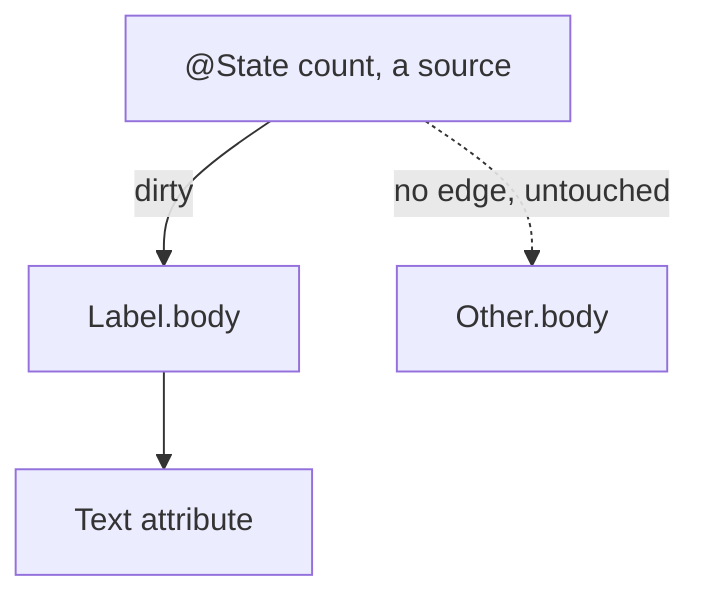

# SwiftUI Is One Graph

I set out to rebuild SwiftUI's engine in pure Swift. No SwiftUI, no UIKit, no AppKit, no QuartzCore, not even Core Graphics. The goal was simple and a little stubborn: if the engine is just logic, it should run anywhere Swift runs, including Windows and Linux, with only the bottom layer that talks to the screen being platform specific. Author a view on a Mac, treat real SwiftUI as the oracle, reproduce it, then run the verified engine unchanged off the Mac.

To do that you have to understand what SwiftUI really is, not what the tutorials say it is. So I derived it from first principles, measured every behavior against the real framework, and only then read Apple's patent on it. The patent described the engine I had just written. That is the story, but first the engine.

## A view is a value, not an object

When you write a SwiftUI view you are not creating a thing on screen. You are describing what the screen should look like, as a cheap struct that gets thrown away and rebuilt constantly. This trips people up because it feels wasteful. It is not. The struct is disposable on purpose. The part of your UI that actually persists lives somewhere else entirely.

That somewhere else is the attribute graph, and it is the whole game.

## The attribute graph

Every view compiles into a graph of attributes. An attribute is one node with exactly two things: a cached value, and a rule that computes that value from its inputs. A view's `body` is itself an attribute whose rule is "evaluate this body."

The clever part is how edges form. When a rule runs and reads another attribute, an edge is recorded between them. Dependencies are never declared. They are discovered, by watching what each body actually reads while it runs. You get the dependency graph for free, just by evaluating.

Now the reactive behavior everyone loves, explained without magic. You change one piece of state. SwiftUI does not rebuild the world. It marks that single source attribute dirty and pushes the dirty flag forward along the edges, to exactly the attributes that depended on it and to nobody else. That set is the cone. Then, lazily, when the screen needs a value, it pulls. It walks down to the dirty inputs, recomputes only those, caches them, and bubbles the result back up. An attribute whose inputs did not change returns its cache and its rule never runs. That is why a screen with a thousand views re-runs the body of only the one that changed.



The cone is the whole efficiency story. A naive rebuild touches every body in the interface, so its cost grows with the screen. The graph touches only the dirty node and what truly depends on it, so its cost tracks the change, not the size of the UI.

```chart
type: bar
title: Bodies re-run when one row changes in a list of twenty
y-label: Bodies re-run
categories: Rebuild the world, Demand-driven graph
series: Bodies = 20, 1
```

There is one more piece that matters for performance. If a recomputed value comes out equal to what it was before, propagation stops there. An unchanged value never disturbs anything downstream, so a state change that happens to produce the same result costs almost nothing.

## State and identity

Because the view struct is disposable, your `@State` cannot live inside it. It lives in persistent storage, keyed by the view's identity. Identity is structural, meaning the view's type and position in the tree, unless you override it with an explicit `id`.

This one rule explains a lot of confusing behavior. As long as the identity is stable, your state survives every rebuild of the struct. The moment the identity changes, by changing `.id` or by removing and reinserting the view, the old state is destroyed and a fresh one is created at its default. It is also why a `List` can recycle its rows without losing their state. The state follows the identity, not the position on screen. Reorder the data and each row's state travels with its identifier.

## Layout is a negotiation

Layout is three steps and one rule. The parent proposes a size to the child. The child chooses its own size. The parent then places the child. The rule is that the parent never forces a size on the child. A stack divides its space among its children, giving the least flexible ones their size first and sharing what is left. Text measures itself through the text engine, with kerning and the font's own line metrics, which is why a label is exactly as wide as it needs to be.

## How it becomes pixels, and the part people get wrong

SwiftUI sits on Core Animation. Core Animation holds the layer state, position, opacity, transform, the properties the GPU composites and the render server interpolates. Core Graphics paints the content, text and shapes, into bitmaps that become a layer's contents.

Here is the part most people get wrong. SwiftUI does not make one layer per view. UIKit does that, where every view is layer backed one to one. SwiftUI coalesces. A stack of ten text labels is usually a single layer with a single drawing, not eleven layers. A view earns its own layer only when it needs a layer level property, like opacity or a transform. This is a real reason SwiftUI is efficient. A long list is a handful of layers for the compositor to manage, not thousands. The tradeoff is that coalesced content has to be redrawn when it changes, while a dedicated layer can move without a redraw. For typical interfaces that trade is a clear win.

```chart
type: bar
title: Layers for a stack of ten text labels
y-label: Layers created
categories: One layer per view, SwiftUI coalesced
series: Layers = 11, 1
```

## Animation, the beautiful part

When you change a value inside `withAnimation`, the model value jumps straight to its target. It does not crawl there. Instead the framework makes a copy of that destination, and into the copy it injects an intermediate value, interpolated for this exact instant. The view draws the copy. Your data is already at the final value. Only the presentation is in flight.

Each animation is a tiny record: a from value, a to value, a timing function, and a start time. That is all it needs. Time itself is just another input to the graph. Every frame a clock ticks, that tick dirties only the animated attributes, and they re-pull a fresh interpolated value through the same cone machinery as everything else. The interpolation works on a delta vector, the difference between from and to, scaled by the curve. A spring is not a special case. It is a damped harmonic oscillator solved over time, which is exactly why it overshoots and then settles. And because the animation is committed once and the render server interpolates on its own clock, it keeps running smoothly even when your main thread is busy.

Two lines of math carry the whole motion. The presented value is the start plus the delta, scaled by the curve, so the data sits at the target while only the presentation moves:

$$v(t) = v_{from} + (v_{to} - v_{from}) p(t)$$

A spring is the same machinery with the fixed curve replaced by a damped harmonic oscillator, which is exactly why it overshoots its target and then settles:

$$x(t) = e^{-\zeta \omega_0 t} \cos(\omega_d t)$$

## Then I read the patent

US 11,042,388 B2, granted June 22, 2021, priority June 3, 2018. Inventors Jacob Xiao, Kyle Macomber, Joshua Shaffer, and John Harper, the same John Harper who created Core Animation in 2006.

Figure 13 describes the attribute graph in plain words. An attribute graph supports zero to n inputs, applies a function on the inputs to calculate an output, stores the output in a persistent memory structure, and whenever any input changes the function gets re-run. Affected attributes set a dirty bit, and the tree is traversed bottom up so that dirty attributes initiate an update. That is the node I had already written, down to the dirty bit and the bottom up pull.

Figure 7 describes the animation record. It has four fields: from value, to value, animation function, start time. That is the exact struct I had already written to drive my animations. Figure 8 describes the method as generating a copy of the destination state and injecting an intermediate value into the copy for rendering. That is the model and presentation split I had derived by watching the real framework.

I had not copied the patent. I had reconstructed the engine from how SwiftUI behaves, then found the patent describing the same machine. When two people arrive at the same structure independently, it is usually because the structure was forced by the problem, not chosen by taste.

## One graph, one cone, drawn lazily

That is the whole of it. A single demand-driven graph. State flows down through the environment, preferences flow up from children to parents, time is just another input, the graph recomputes only what truly changed, and it hands a coalesced layer tree to Core Animation to composite. Strip away the syntax and SwiftUI is one graph, one cone, drawn lazily.

And the reason I cared enough to rebuild it: once the engine is just a graph and some Swift, the Mac stops being required. The semantics run anywhere. Only the last inch, the part that puts pixels on a panel, stays platform specific. The foundation was never the platform. It was always the graph.
