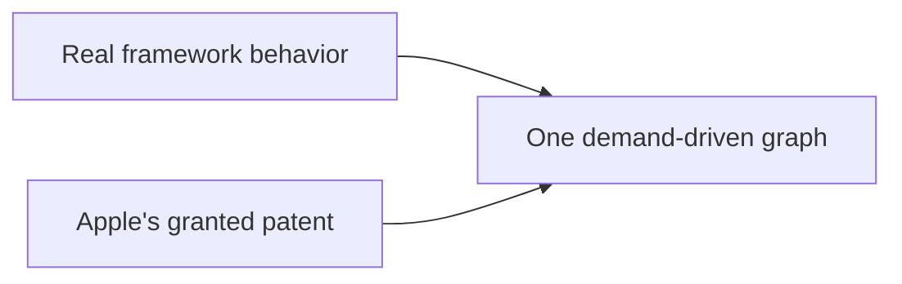
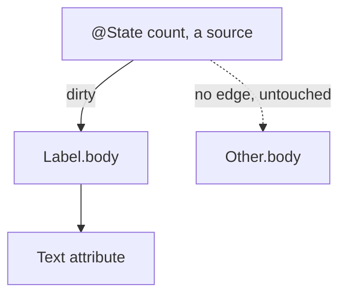
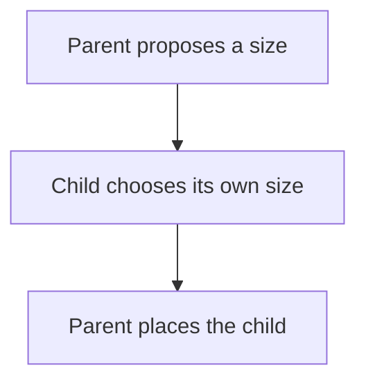
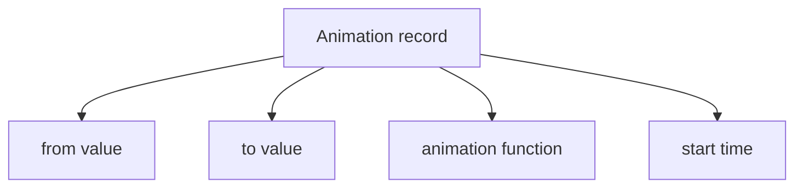
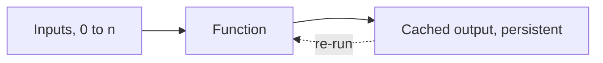
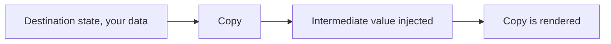
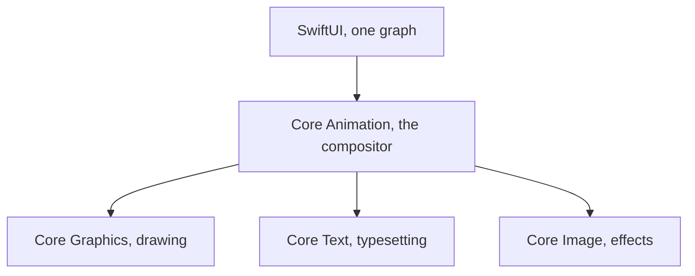

# SwiftUI Is One Graph, Over 40+ Years of Engineering

I wanted to know what SwiftUI really is, not what the tutorials say it is. So I came at it from two directions that cannot collude. I measured the real framework's behavior until it was predictable, the way you probe any black box, and I read Apple's own patent on it, line by line. The shipping framework is the oracle. The granted patent is Apple describing its own machine. When the two agree, you are no longer guessing.



And they agree, almost field for field. What they describe together is simpler and stranger than the usual story: not a view tree that gets diffed, but a single demand-driven graph. I will show you that graph, because it is genuinely elegant. Then, at the end, I will tell you why it is the part of Apple's stack I find least interesting, and what I have been doing about that. First the engine.

## A view is a value, not an object

When you write a SwiftUI view you are not creating a thing on screen. You are describing what the screen should look like, as a cheap struct that gets thrown away and rebuilt constantly. This trips people up because it feels wasteful. It is not. The struct is disposable on purpose. The part of your UI that actually persists lives somewhere else entirely.

That somewhere else is the attribute graph, and it is the whole game.

## The attribute graph

Every view compiles into a graph of attributes. An attribute is one node with exactly two things: a cached value, and a rule that computes that value from its inputs. A view's `body` is itself an attribute whose rule is "evaluate this body."

The clever part is how edges form. When a rule runs and reads another attribute, an edge is recorded between them. Dependencies are never declared. They are discovered, by watching what each body actually reads while it runs. You get the dependency graph for free, just by evaluating.

Now the reactive behavior everyone loves, explained without magic. You change one piece of state. SwiftUI does not rebuild the world. It marks that single source attribute dirty and pushes the dirty flag forward along the edges, to exactly the attributes that depended on it and to nobody else. That set is the cone. Then, lazily, when the screen needs a value, it pulls. It walks down to the dirty inputs, recomputes only those, caches them, and bubbles the result back up. An attribute whose inputs did not change returns its cache and its rule never runs. That is why a screen with a thousand views re-runs the body of only the one that changed.



The cone is the whole efficiency story. A naive rebuild touches every body in the interface, so its cost grows with the screen. The graph touches only the dirty node and what truly depends on it, so its cost tracks the change, not the size of the UI.

```chart
type: line
title: Bodies re-run for one change as the screen grows
x-label: Views on screen
y-label: Bodies re-run
x: 200, 400, 600, 800, 1000
series: Rebuild the world = 200, 400, 600, 800, 1000
series: Demand-driven graph = 1, 1, 1, 1, 1
```

There is one more piece that matters for performance. If a recomputed value comes out equal to what it was before, propagation stops there. An unchanged value never disturbs anything downstream, so a state change that happens to produce the same result costs almost nothing.

## State and identity

Because the view struct is disposable, your `@State` cannot live inside it. It lives in persistent storage, keyed by the view's identity. Identity is structural, meaning the view's type and position in the tree, unless you override it with an explicit `id`.

This one rule explains a lot of confusing behavior. As long as the identity is stable, your state survives every rebuild of the struct. The moment the identity changes, by changing `.id` or by removing and reinserting the view, the old state is destroyed and a fresh one is created at its default. It is also why a `List` can recycle its rows without losing their state. The state follows the identity, not the position on screen. Reorder the data and each row's state travels with its identifier.

## Layout is a negotiation

Layout is three steps and one rule. The parent proposes a size to the child. The child chooses its own size. The parent then places the child. The rule is that the parent never forces a size on the child. A stack divides its space among its children, giving the least flexible ones their size first and sharing what is left. Text measures itself through the text engine, with kerning and the font's own line metrics, which is why a label is exactly as wide as it needs to be.



## How it becomes pixels, and the part people get wrong

SwiftUI sits on Core Animation. Core Animation holds the layer state, position, opacity, transform, the properties the GPU composites and the render server interpolates. Core Graphics paints the content, text and shapes, into bitmaps that become a layer's contents.

Here is the part most people get wrong. **SwiftUI does not make one layer per view. UIKit does that, where every view is layer backed one to one. SwiftUI coalesces. A stack of ten text labels is usually a single layer with a single drawing, not eleven layers.** A view earns its own layer only when it needs a layer level property, like opacity or a transform. This is a real reason SwiftUI is efficient. A long list is a handful of layers for the compositor to manage, not thousands. The tradeoff is that coalesced content has to be redrawn when it changes, while a dedicated layer can move without a redraw. For typical interfaces that trade is a clear win.

```chart
type: bar
title: Layers for a stack of ten text labels
y-label: Layers created
categories: One layer per view, SwiftUI coalesced
series: Layers = 11, 1
```

## Animation, the beautiful part

When you change a value inside `withAnimation`, the model value jumps straight to its target. It does not crawl there. Instead the framework makes a copy of that destination, and into the copy it injects an intermediate value, interpolated for this exact instant. The view draws the copy. Your data is already at the final value. Only the presentation is in flight.

Each animation is a tiny record: a from value, a to value, a timing function, and a start time. That is all it needs.



Time itself is just another input to the graph. Every frame a clock ticks, that tick dirties only the animated attributes, and they re-pull a fresh interpolated value through the same cone machinery as everything else. The interpolation works on a delta vector, the difference between from and to, scaled by the curve.

A spring is not a special case. It is a damped harmonic oscillator solved over time, which is exactly why it overshoots and then settles. And because the animation is committed once and the render server interpolates on its own clock, it keeps running smoothly even when your main thread is busy.

```chart
type: line
title: A spring overshoots its target, then settles
x-label: Time
y-label: Value
x: 0, 1, 2, 3, 4, 5, 6, 7, 8
series: Spring = 0, 80, 120, 95, 105, 99, 101, 100, 100
```

Two lines of math carry the whole motion. The presented value is the start plus the delta, scaled by the curve, so the data sits at the target while only the presentation moves:

$$v(t) = v_{from} + (v_{to} - v_{from}) p(t)$$

A spring is the same machinery with the fixed curve replaced by a damped harmonic oscillator, which is exactly why it overshoots its target and then settles:

$$x(t) = e^{-\zeta \omega_0 t} \cos(\omega_d t)$$

## What the patent says

US 11,042,388 B2, granted June 22, 2021, priority June 3, 2018. Inventors Jacob Xiao, Kyle Macomber, Joshua Shaffer, and John Harper, the same John Harper who created Core Animation in 2006.


*John Harper, via his GitHub.*

Hold that name. Apple the company would not exist without Steve Jobs. **The iPhone, and the whole fluid, animated, GPU-composited kingdom that grew on top of it, iOS, iPadOS, watchOS, tvOS, and visionOS, would not exist as we know it without John Harper.** The same hand drew the engine that runs underneath all of it, from Core Animation in 2006 to the very graph this post is about. SwiftUI is just the newest room in a house whose foundation he poured. **He is the John Carmack of Apple, its Linus Torvalds: the engineer whose work a billion people touch every day and whose name almost none of them know.** That is a shame, and correcting it, in my own small way, is part of why I am writing all this.



As you can see in the image above, the patent lays the attribute graph out in plain words. It supports zero to n inputs, applies a function on the inputs to calculate an output, stores the output in a persistent memory structure, and whenever any input changes the function gets re-run. Affected attributes set a dirty bit, and the tree is traversed bottom up so that dirty attributes initiate an update. That is exactly what the behavior shows, down to the dirty bit and the bottom up pull, now in Apple's own words.

It also spells out the animation record as the same four fields the behavior implies: from value, to value, animation function, start time.



And as the image above shows, the patent describes the method as generating a copy of the destination state and injecting an intermediate value into the copy for rendering. That is the model and presentation split you can watch the real framework perform.

I did not take any of this from the patent. The behavior and the patent are two independent witnesses, and they arrive at the same machine. When the framework you can observe and the patent Apple was granted describe the same structure, that structure is real, forced by the problem, not chosen by taste.

## One graph, one cone, drawn lazily

That is the whole of it. A single demand-driven graph. State flows down through the environment, preferences flow up from children to parents, time is just another input, the graph recomputes only what truly changed, and it hands a coalesced layer tree to Core Animation to composite. Strip away the syntax and SwiftUI is one graph, one cone, drawn lazily.

And here is the part I will only hint at. This was never really about SwiftUI. It began with Core Animation, because I wanted to understand it, and **the only way I trust to understand a thing is to build it again from nothing**. But you cannot understand Core Animation without the drawing layer beneath it, so that came next.


A text layer pulls you into typesetting. Transitions pull you into image processing. Each engine demanded the one below it, until the whole stack stood on its own and SwiftUI settled on top almost as an afterthought. None of it ships, and none of it is for sharing. It is mine, a way to learn the machine by rebuilding it, and it has a name: SlayerMotion.



**Of the five, SwiftUI interests me the least, by a wide margin.** It was not even born to be the future of the platform: it started as a way to make watchOS apps bearable to write, and only once it existed did Apple look at it and see what they had, and take it everywhere. It arrived with a quiet promise: that you could finally skip all of it, the dozen frameworks underneath, and just ship.


That promise was a lie. You can ship, yes, but you have not learned the platform, you have learned a facade over it, and the day something leaks through, a layout that will not behave, an animation that stutters, text that measures wrong, you are standing on a stack you never met. The people who took SwiftUI as a way around the frameworks did not become Apple developers. They became SwiftUI users, and that is a different and smaller thing.

Set beside the engines underneath it, SwiftUI is genuinely uninteresting, boring even, a thin and tidy graph that does one clever thing and then gets out of the way. The one that floored me at the start still floors me most, and I suspect always will: Core Animation, a compositor that keeps an animation running smooth on its own clock while your app is busy elsewhere. The drawing layer, the type engine, the image pipeline are close behind. That is where the hard, strange, beautiful problems live, and that is the series. **SwiftUI was just the easiest door into the story.**
