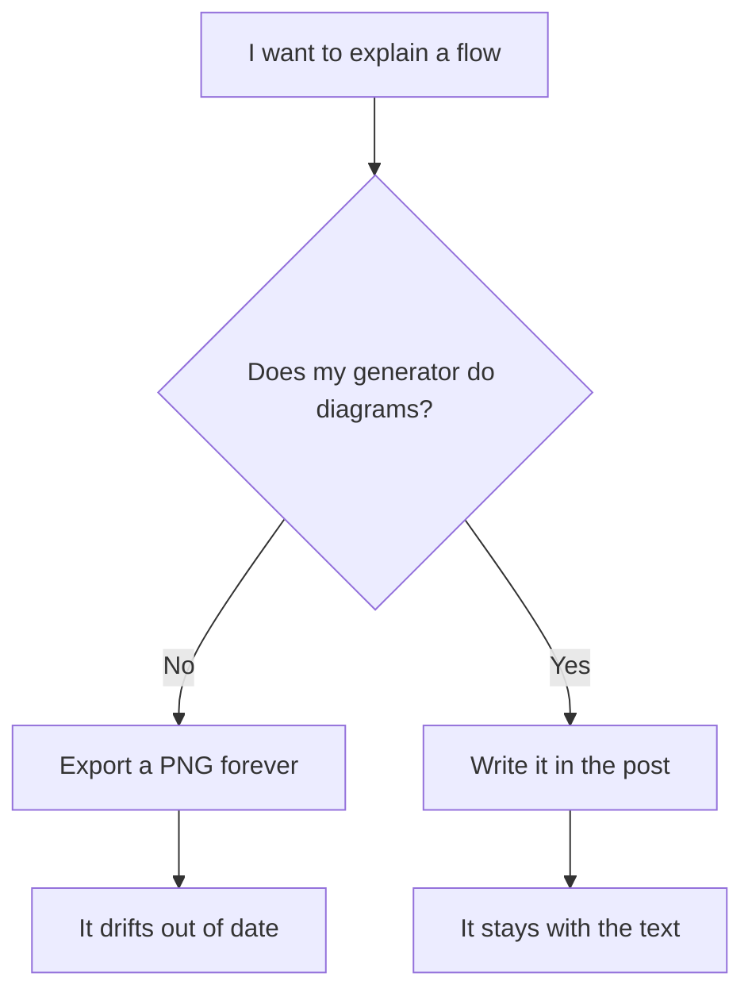

# Why I built TileDown

I already had a static site generator. It was small, fast, and pleasant, and for a
while that was enough. Then I started wanting things it was never going to give me,
and every workaround made the setup more fragile instead of less.

So I wrote down what I actually wanted from a blog. It turned into a short,
stubborn list.

## I wanted diagrams in the prose

Not screenshots of diagrams. Not a separate tool that exports a PNG I have to keep
in sync by hand. A fenced block, in the article, that renders:



## I wanted charts that are just text

Same idea, numbers instead of boxes. I describe the data in a few lines and the
build hands me a static SVG. No chart library, no script tag, no runtime:

```chart
type: bar
title: What my old setup made hard
categories: Diagrams, Charts, PDF, Math, Dynamic
y-label: pain (made up units)
series: Before = 8, 7, 9, 9, 10
```

The numbers are invented. The rendering is real, and it uses the same notation the
PDF side understands, which matters for the next part.

## I wanted the PDF of the article, for free

If you are reading this on the site, there is a Download PDF button near the top of
the page. I did not build it by hand for this post. The same engine that lays out
this page lays out a print version, from the same Markdown, so every article ships
a PDF without me thinking about it.

## I wanted real math

Typeset at build time into static SVG, themed to the page. No MathJax, no web font,
no LaTeX install:

$$\int_{-\infty}^{\infty} e^{-x^2}\,dx = \sqrt{\pi}$$

## And I wanted a way out of "static forever"

This is the part that made it a project instead of a config file. Static sites are
wonderful until the day you want one live thing on the page: a counter, an embed, a
form that talks to a backend. Most generators answer that with "drop in some
JavaScript and good luck."

I wanted that one live thing to be a first-class, typed unit of content. So
TileDown has tiles. A tile renders to HTML, scoped CSS, and only the JavaScript it
needs, and nothing else on the page pays for it. Here is one:

:::tile counter
label: A small live thing on a static page
:::

Today tiles cover the client-side cases: counters, embeds, callouts. The next step
is tiles that talk to a backend, a form that hits a real service, and that work is
still coming. But the model is the point. Dynamic behavior is a tile, not a hole I
cut in the static output.

## That is the whole reason

Diagrams, charts, a free PDF, real math, and a typed path to dynamic content. None
of those is exotic on its own. I just could not get all of them from one tool
without the setup fighting me, so I built the tool. This post is written in plain
Markdown and rendered by it.

```sh
brew install tiledown/tap/tiledown
```
